# Watson Assistant - DB2
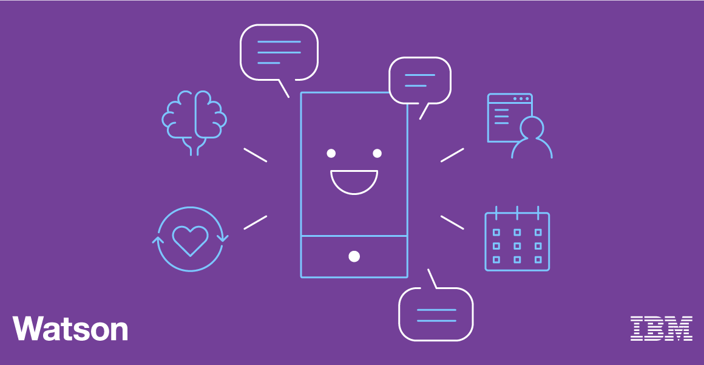  

Crea un asistente virtual que se conecta a una base de datos estructurada y hace consultas en ella!
# Pre-requisitos
•	Tener instalado [**Node.js**](https://nodejs.org/es/). 
•	Tener una cuenta de [**IBM Cloud**](https://cloud.ibm.com/login). 
•	Tener una cuenta en [**Github**](https://github.com). 
•	Instalar CLI de [**IBM Cloud**](https://cloud.ibm.com/docs/cli/reference/ibmcloud?topic=cloud-cli-install-ibmcloud-cli) 
•	Instalar CLI de [**Github**](https://git-scm.com/book/en/v2/Getting-Started-Installing-Git) 
•	Clonar este Repositorio.  
• Instalar el plugin de Cloud Functions
###
    ibmcloud plugin install cloud-functions
# Cupones para Estudiantes y profesores
1.	Acceder al [**HUB para Software para uso académico**](https://onthehub.com/ibm/?utm_sourc=ibm-ai-productpage&utm_medium=onthehubproductpage&utm_campaign=IBM). Y navegar hasta la parte de abajo de la pagina  
2.	Buscar el WebStore del instituto/escuela al que perteneces. 
3.	En caso de no contar con WebStore, acceder al portal de [**IBM Academic Initiative**](https://my15.digitalexperience.ibm.com/b73a5759-c6a6-4033-ab6b-d9d4f9a6d65b/dxsites/151914d1-03d2-48fe-97d9-d21166848e65/home/), registrarse o iniciar sesión y seleccionar la opción de Students 
4.	Seleccionar Add to Cart para IBM Bluemix – 6 Month Trial. 
5.	Realizar el registro correspondiente utilizando la cuenta de correo académica 

# Cargar créditos en IBM Cloud
1.	Ingresamos a nuestro panel de control de IBM Cloud (console.bluemix.net)
2.	Una vez que tengamos el código nos vamos a Gestionar>Facturación y Uso>Facturación
3.	Buscamos “Códigos de características (Promocionales)”

# Configuración de servicio DB2 
1. Abrimos la terminal, clonamos este repositorio y entramos a la carpeta clonada utilizando el siguiente comando:
###
    git clone https://github.com/IBM-Cloud/slack-chatbot-database-watson
    cd slack-chatbot-database-watson

2. Iniciamos sesión en IBM Cloud con el siguiente comando (Utiliza el correo y contraseña de tu cuenta) :
###
    ibmcloud login
 
3. Hacemos un target a un resource group utilizando el siguiente comando:
###
    ibmcloud target -g RESOURCE_GROUP
  donde RESOURCE_GROUP es el grupo a apuntar. Si quieres saber qué grupos están disponibles puedes utilizar el siguiente comando:
###
    ibmcloud resource groups
  Para efectos prácticos de este tutorial, apuntaremos a un resource group default:
###
    ibmcloud target -g default

4. Creamos un servicio DB2 en una instancia de cloud y la nombramos "eventDB"
###
    ibmcloud resource service-instance-create eventDB dashdb-for-transactions free us-south

5. Para acceder al servicio de base de datos de Cloud Functions más adelante, necesitamos autorización. Por lo tanto, crearemos credenciales de servicio y las etiquetaremos con el nombre "slackbotkey":
###
    ibmcloud resource service-key-create slackbotkey Manager --instance-name eventDB
    
6. Registraremos acciones para Cloud Functions y a enlazaremos credenciales de servicio a dichas acciones. La acción dispatch se habilita como una acción web y se establece una palabra secreta para evitar invocaciones no autorizadas. Elejimos una palabra secreta y la utilizaremos como parámetro; sustituimos YOURSECRET con la palabra secreta en el comando que se muestra abajo. 
En este comando se invoca una de las acciones para crear una tabla en Db2 on Cloud mediante el uso de una acción de Cloud Functions. Para realizar el registro y la configuración, ejecute la línea siguiente; esto ejecutará el script setup.sh (Se encuentra en la carpeta clonada del repositorio). Si el sistema no da soporte a comandos de shell, copie cada línea fuera del archivo setup.sh y ejecútela individualmente en la terminal.
###
    sh setup.sh YOURSECRET "dashdb-for-transactions"
**Nota: de forma predeterminada, el script también inserta unas pocas filas de datos de ejemplo. Para inhabilitarlo, comente la siguiente línea en el script anterior:
###
    ibmcloud fn action invoke slackdemo/db2Setup -p mode "[\"sampledata\"]" -r

7. Obtenemos el URI correspondiente a la acción dispatch desplegada.
###
    ibmcloud fn action get slackdemo/dispatch --url

# Creación del servicio/ Carga el skill
1. Entrar al portal de [**IBM Cloud**](https://cloud.ibm.com/)
2. Ir al catalogo

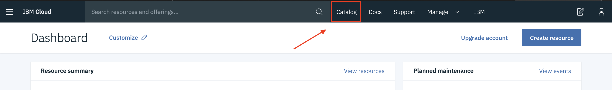  

3. Seleccionar la opción AI del menú lateral y dar clic en el servicio “WatsonAssistant”.

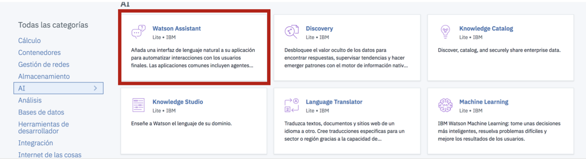  

4. Le damos un nombre al servicio y lo creamos

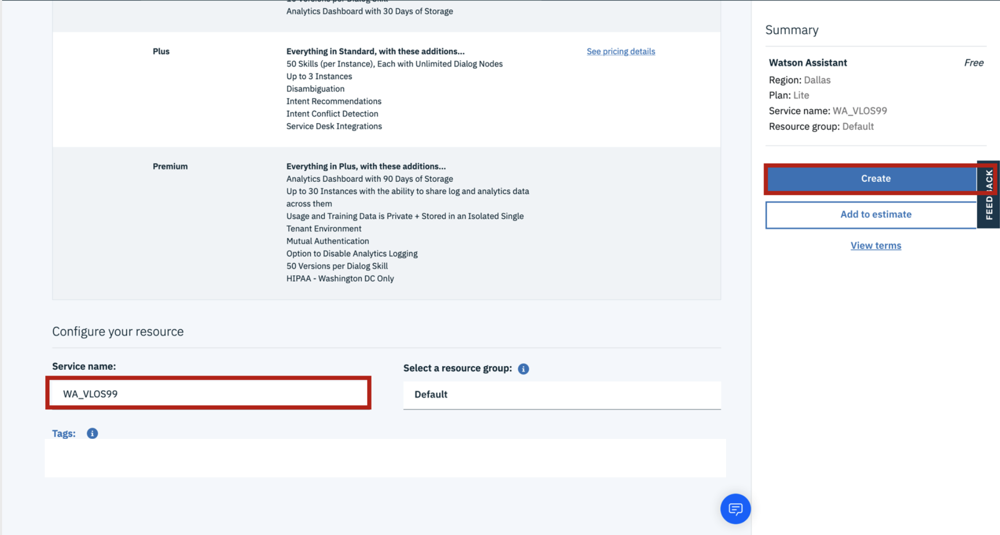  

5. Del menú izquierdo, seleccionamos el apartado Manage y damos clic en "Launch Watson Assistant" para empezar con nuestro servicio.

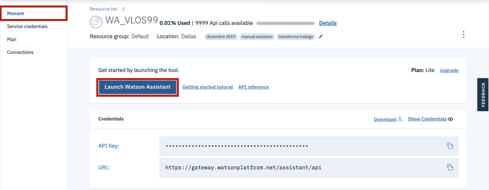  

6. Una vez que hayamos lanzado la herramienta damos clic en el apartado skills del lado izquierdo y damos clic en "Create Skill".

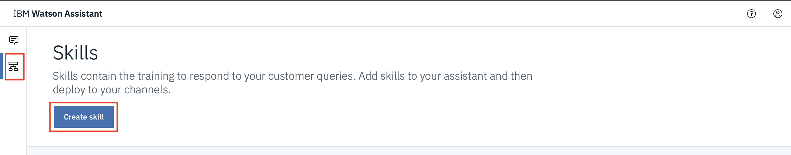  

7. Damos clic en "Dialog Skill" y damos clic en next.

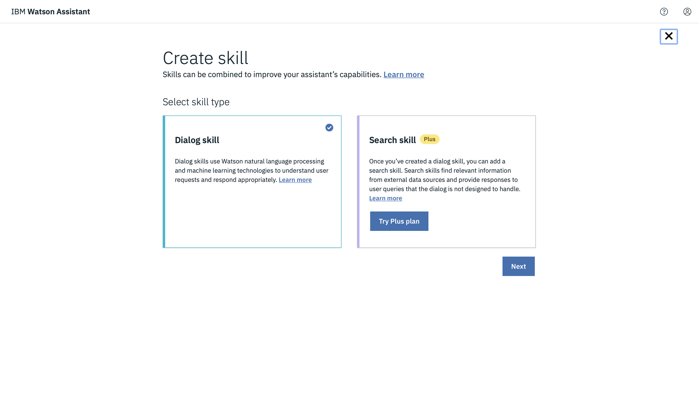  

8. Damos clic en "Import Skill" y damos clic en "Choose JSON File", cargamos el skill.json que está en este repositorio y damos clic en "Import".

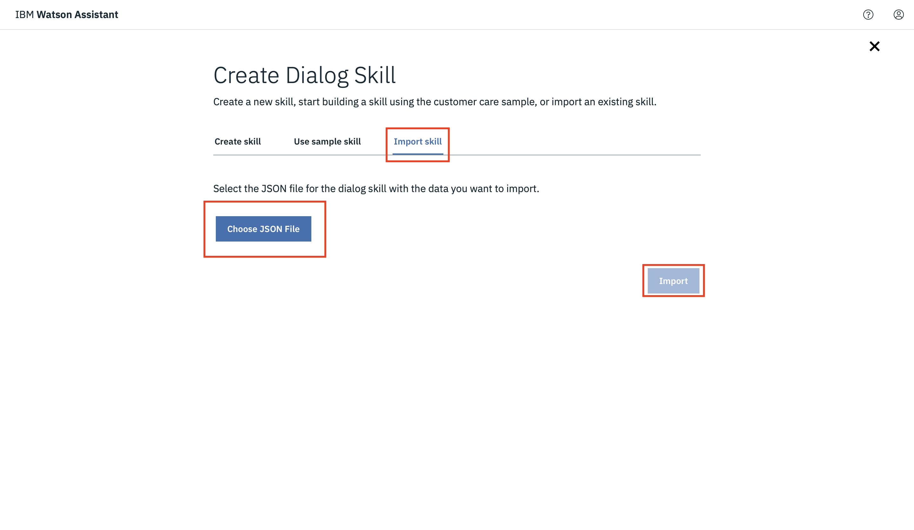  

9. En la parte izquierda, damos clic en "Dialog" para ver los nodos del diálogo. Podemos ampliarlos para ver una estructura como la que se muestra a continuación.

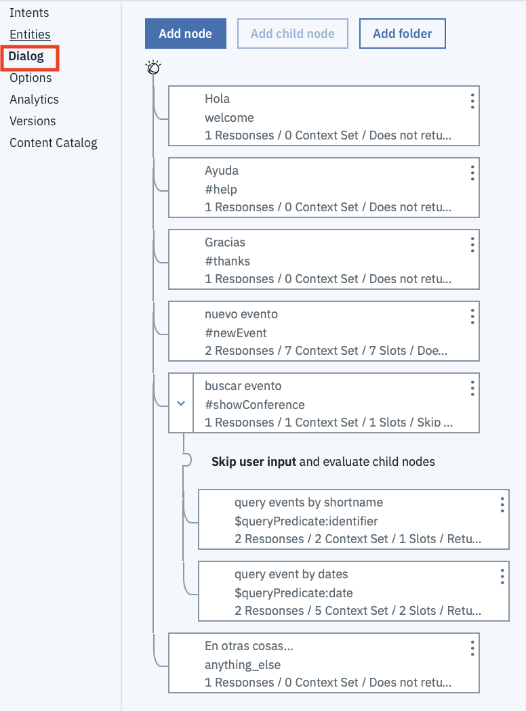  

El diálogo tiene nodos para manejar las preguntas de ayuda y de agradecimiento. El nodo "nuevo evento" recopila la entrada necesaria y luego invoca el webhook para insertar un nuevo registro de sucesos en Db2.

El nodo "buscar eventos" clarifica si los sucesos se buscan por su identificador o por fecha. Realizan la búsqueda real y la recopilación de los datos necesarios en los nodos hijo query events by shortname y query event by dates.

10. En la parte izquierda de la interfaz, pulse Opciones y luego Webhooks. Sustituye el valor de URL por el que obtuvimos en la sección anterior. Añada .json al URL para indicar que se deben devolver datos JSON. No olvides sustituir el valor HEADER VALUE por el valor "YOURSECRET" que establecimos anteriormente.

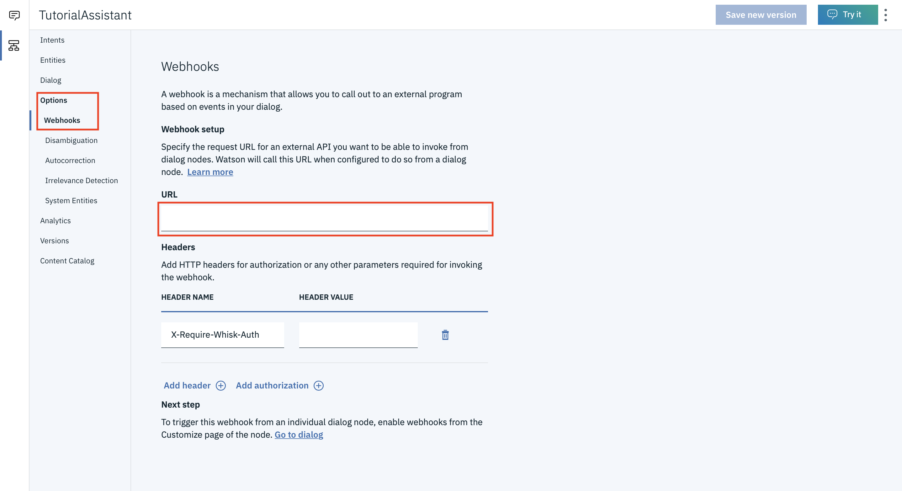  

11. Hacemos clic en el botón "Try it" en la parte superior derecha para ver al chatbot en acción. Podemos escribir cosas como "Quiero crear un nuevo evento" para que podamos registrar un nuevo evento, o podemos escribir algo como "mostrar información de eventos" para que podamos consultar los eventos guardados.

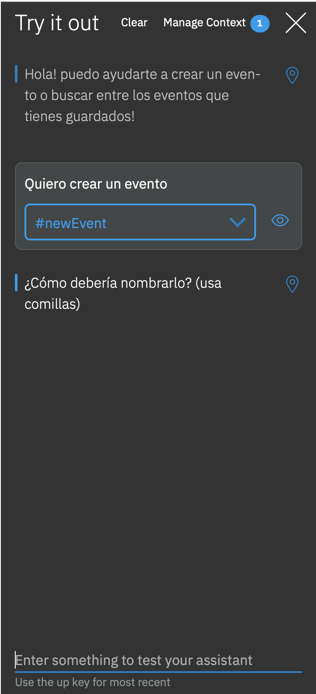  
 
# Creación de un asistente para despliegue
1. Damos clic en "Assistant" en el área de navegación superior izquierda y, a continuación, damos clic en "Create assistant".

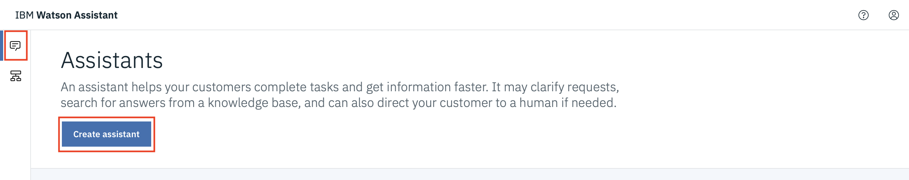  

2. Le damos un nombre y creamos el asistente. Una vez creado nos redirige a otra landing page, damos clic en "Add dialog skill" 

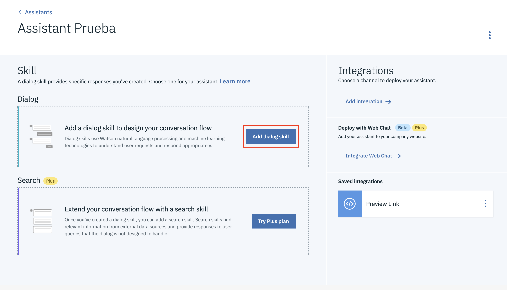  
Añadimos el skill que acabamos de importar.

3. Damos clic en los 3 puntos que se encuentra en la esquina superior derecha y damos clic en el apartado "settings"
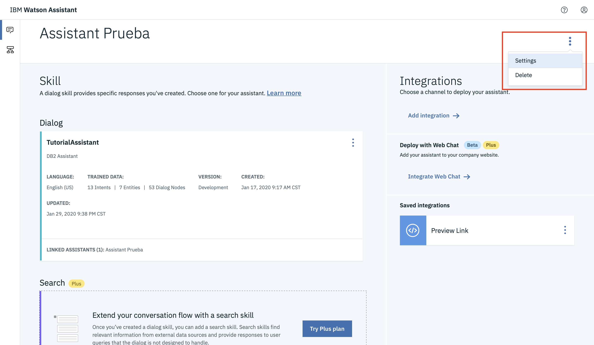  

4. Damos clic en el apartado "API DETAILS" y copiamos los valores "Assistant URL" Y "API KEY"
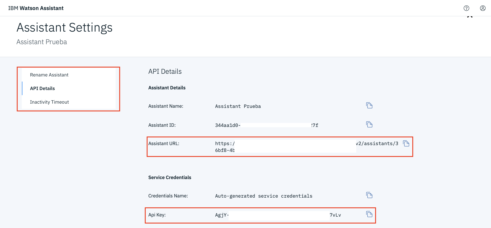  

# Despliegue del assistant: Wordpress
**Nota: para esta parte del chatbot, necesitas tener una cuenta de wordpress creada con un dominio arriba, si quieres utilizar un dominio de prueba, puedes utilizar el proporcionado por el sitio de cognitiveclass, ahí podrás desplegar un assistant desde cero, ingresa a esta [**LIGA**](https://cognitiveclass.ai/courses/how-to-build-a-chatbot) **e inscribete al curso (Modulo 5, laboratorio 8).

Para enlazar este asistente a wordpress, buscamos el plugin de watson assistant desde el apartado "Plugins" y damos clic en "install now"

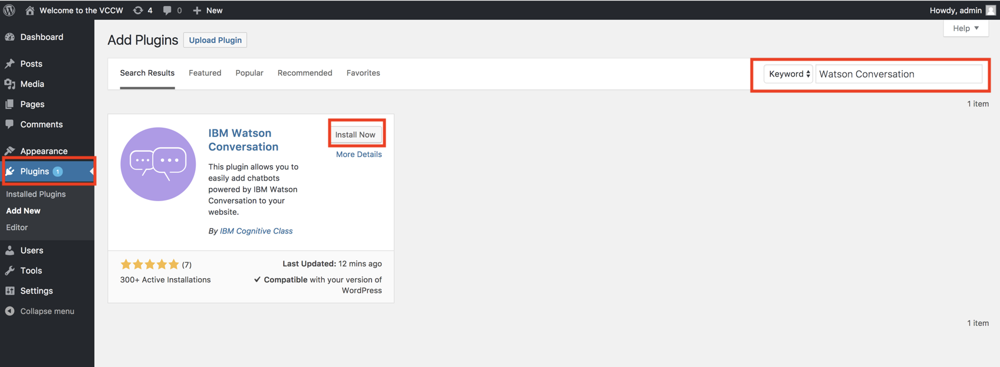  

Una vez instalado podemos visualizar el plugin desde el apartado de "settings", en el apartado "Watson", por ahora, en ese apartado damos clic en el apartado "Main Setup", ahí vamos a colocar las credenciales del chatbot qué obtuvimos previamente. Colocamos en el apartado "Username" la palabra "apikey", en el apartado "Assistant URL" el url que copiamos previamente y en "API KEY" la clave de API que copiamos previamente. Finalmente damos clic en "Save changes"

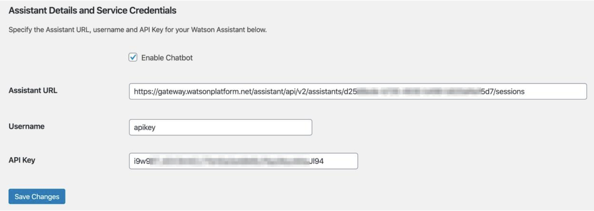  

